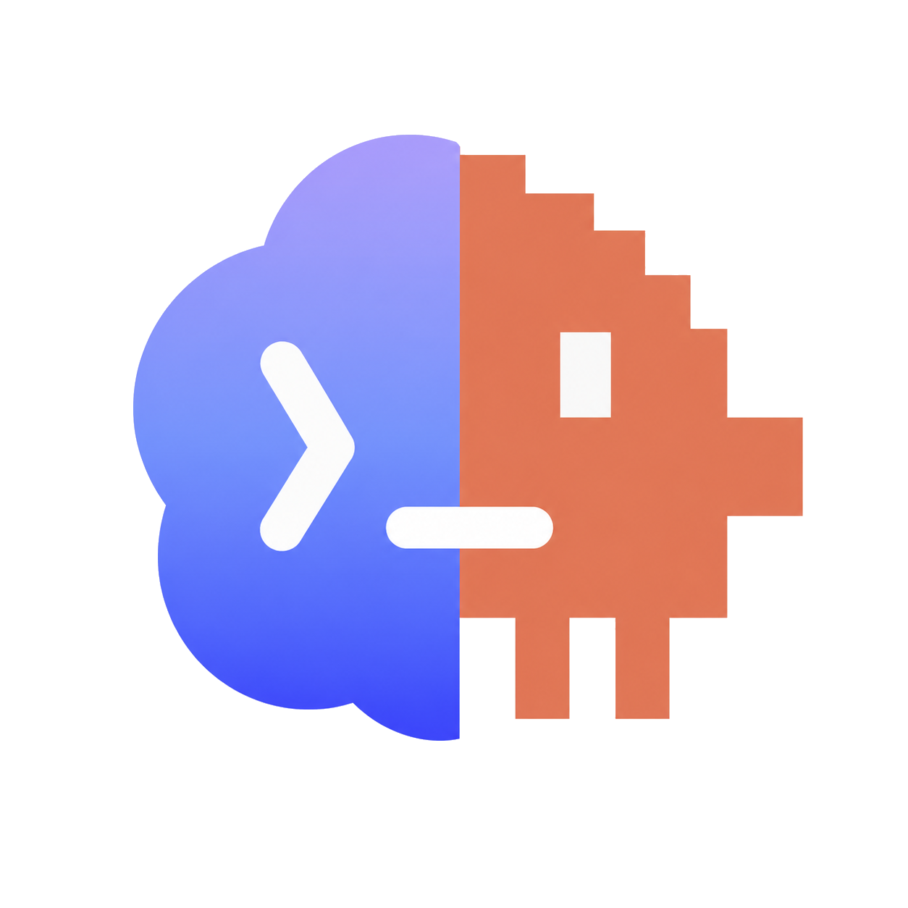
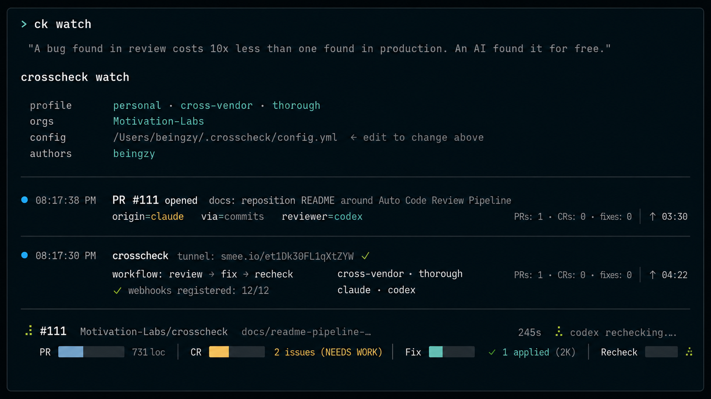

<div align="right">
  <h5><a href="./README.zh.md">🌏 &nbsp;中文</a></h5>
</div>

<p align="center">
  
</p>

<p align="center"><em>A HumanBased AI project, built with crosscheck.</em></p>

# crosscheck

<p align="center">
  
</p>

**Stop merging AI slop. Crosscheck turns agent-written PRs into merge-ready patches with a configurable Review -> Fix -> Recheck pipeline.**

AI coding agents are fast, but they can still ship regressions, half-finished fixes, brittle edge cases, and "early victory" PRs that look done before they are solid. Crosscheck adds an independent safety loop: let one agent write the patch, let another review it, send the findings back to the author, then recheck the result before merge.

Define the workflow in `workflow.yml`: review-only, review + fix, or the full review + fix + recheck cycle. Each step runs through the `claude` or `codex` CLI against your existing subscriptions — no API keys, no per-review cost.

Built by [HumanBased AI](https://github.com/humanbased-ai) as a showcase of practical engineering craft for the agentic coding era.

## Why crosscheck?

- **Combats AI slop before merge** — catches code regressions, incomplete fixes, hallucinated assumptions, and brittle "looks green" patches.
- **Uses independent reviewers** — route Claude-authored PRs to Codex, Codex-authored PRs to Claude, or run a single-vendor loop when that is what you have.
- **Closes the loop** — review findings can become a fix step and then a recheck step, so the PR moves toward real merge readiness instead of another comment thread.
- **Runs on your machine or server** — no new hosted code review service, no per-review API bill, no extra infrastructure to trust.

---

## Quick start

```bash
# 1. Install crosscheck and the agent CLIs
npm install -g @humanbased/crosscheck
npm install -g @anthropic-ai/claude-code && claude        # Claude Pro/Max subscription
npm install -g @openai/codex && codex login --device-auth # ChatGPT Plus/Pro subscription
brew install gh && gh auth login                          # GitHub CLI

# 2. Guided setup — repos, review mode, workflow pipeline
crosscheck onboard

# 3. Start watching
crosscheck watch        # personal laptop
crosscheck serve        # always-on team server
```

---

## Commands

```bash
crosscheck onboard                  # guided setup — pick repos, mode, and pipeline
crosscheck watch                    # personal use — tunnel + webhook + listening on your laptop
crosscheck serve                    # team use — fixed port, register webhook once
crosscheck review <pr-url>          # one-shot review of a specific PR
crosscheck run <pr-url>             # run the full workflow: review → fix → recheck
crosscheck scan                     # show open PR workflow state across monitored repos
crosscheck detect-step <pr-url>     # explain the next workflow step for one PR
crosscheck kickass                  # advance stale PRs from an interactive operator queue
crosscheck init                     # check prerequisites, write starter config
crosscheck status                   # auth state, config summary, CLI versions
```

**Operator queue (scan + kickass)**

`crosscheck scan` tracks two independent dimensions per PR:

| Workflow stage (`reviewState`) | Meaning | Next action |
|---|---|---|
| `NEEDS_REVIEW` | No crosscheck review for current HEAD | review |
| `NEEDS_FIX` | Reviewed — fix requested | fix |
| `NEEDS_RECHECK` | Fix committed, recheck pending | recheck |
| `APPROVED` | Reviewed and approved | merge |

| Verdict (`verdict`) | Meaning |
|---|---|
| `UNREVIEWED` | No review found |
| `APPROVE` | AI approved |
| `NEEDS_WORK` | AI requested changes |
| `BLOCK` | AI hard-blocked merge |

`BLOCK` and `NEEDS_WORK` both map to `NEEDS_FIX` stage — same next action, but the `verdict` field preserves severity so operators can prioritise.

**How workflow steps are counted**

Crosscheck reconstructs PR workflow state from visible artifacts:

| Evidence | Counts as |
|---|---|
| Review or recheck comment with `<!-- crosscheck: ... verdict=... -->` | completed `review` / `recheck` step |
| Fix or conflict-resolve comment, such as `<!-- crosscheck: fix_applied ... -->` | completed `fix` / `conflict-resolve` step |
| PR commit trailer, such as `Crosscheck-Step: fix` | completed step declared by that trailer |

Commit trailers are accepted as operator-declared workflow state. In practice, a PR author may command Claude, Codex, or another agent to apply a fix outside a standalone Crosscheck post; if the resulting PR commit carries `Crosscheck-Step: fix`, Crosscheck counts it as fix evidence.

That evidence only advances the next step to `recheck` when the fix commit is the current PR HEAD. If another commit lands after the fix evidence, Crosscheck starts a fresh review round so the newer code is reviewed normally. This prevents an old fix trailer from marking later changes as ready for recheck.

```bash
crosscheck scan [--tidy] [--stale-after <duration>] [--force] [--json]
crosscheck kickass [--dry-run] [--stale-after <duration>] [--force]
```

`crosscheck review --reviewer`, `crosscheck run --reviewer`, `crosscheck run --fixer`, and `crosscheck run --vendor` accept vendor aliases:
- Claude: `claude`, `claude-code`, `cc`, `anthropic`
- Codex: `codex`, `openai`

**Continuous improvement** *(experimental)*

```bash
crosscheck diagnose                 # surface failure patterns from review logs
crosscheck optimize [--apply]       # rewrite reviewer instructions based on diagnose output
crosscheck impact [--money]         # time saved, issues caught, code quality trends
crosscheck issue                    # draft and file a bug report from recent error logs
```

---

### `crosscheck onboard`

Interactive setup wizard. Picks repos/orgs to monitor, selects single-vendor or cross-vendor mode, configures the review pipeline, and writes `~/.crosscheck/config.yml` and `workflow.yml`.

```bash
crosscheck onboard              # guided setup
crosscheck onboard --personal   # skip persona prompt, go straight to personal mode
crosscheck onboard --team       # skip persona prompt, go straight to team mode
crosscheck onboard -y           # accept all defaults non-interactively
```

---

### `crosscheck watch`

Personal mode. Starts an SSH tunnel (localhost.run), registers GitHub webhooks, and listens for PR events. Everything self-cleans on Ctrl+C.

```bash
crosscheck watch
crosscheck watch --no-backtrace       # skip startup scan for unreviewed open PRs
crosscheck watch --reconfigure        # re-run deployment setup before starting
```

---

### `crosscheck serve`

Team mode. Binds to a fixed port — register the webhook once, cover the whole team. Designed for a mac-mini or home server.

```bash
crosscheck serve
crosscheck serve --no-backtrace       # skip startup scan
crosscheck serve --personal           # personal scope this session only
crosscheck serve --reconfigure        # re-run deployment setup
```

---

### `crosscheck review <pr-url>`

One-shot review of a single PR. Clones, checks out, reviews, and posts the comment.

```bash
crosscheck review https://github.com/org/repo/pull/42
crosscheck review <pr-url> --reviewer claude    # force Claude regardless of detection
crosscheck review <pr-url> --reviewer codex     # force Codex regardless of detection
crosscheck review <pr-url> --reviewer cc        # alias for Claude
crosscheck review <pr-url> --reviewer openai    # alias for Codex
```

---

### `crosscheck run <pr-url>`

Runs the full configured workflow against one PR: review → fix → recheck. Same logic as `watch`/`serve`, but triggered manually.

```bash
crosscheck run <pr-url>
crosscheck run <pr-url> --steps review           # only the review step
crosscheck run <pr-url> --steps fix,recheck      # skip initial review
crosscheck run <pr-url> --reviewer claude        # force review/recheck agent
crosscheck run <pr-url> --fixer claude           # force fix agent
crosscheck run <pr-url> --vendor claude          # force review/recheck/fix agent
crosscheck run <pr-url> --dry-run                # review without posting or fixing
crosscheck run <pr-url> --crazy                  # 🔥🔥 loop until APPROVE
crosscheck run <pr-url> --half-crazy             # 🔥  loop until not BLOCK
crosscheck run <pr-url> --timeout 10m            # custom reviewer timeout
```

---

### `crosscheck scan`

Scans every open PR in the configured monitor scope and reports where each one is in the crosscheck workflow. Results are cached for 60 seconds.

States: `NEEDS_REVIEW` · `NEEDS_FIX` · `BLOCK` · `NEEDS_RECHECK` · `APPROVE`

```bash
crosscheck scan                          # all open PRs, grouped stale/not-stale
crosscheck scan --tidy                   # stale actionable rows only
crosscheck scan --stale-after 4h         # custom staleness threshold (default 24h)
crosscheck scan --force                  # bypass cache
crosscheck scan --json                   # machine-readable output
```

---

### `crosscheck detect-step`

Explains the workflow history for one PR and prints the next step Crosscheck would run. Use this when a PR has mixed evidence from comments, Crosscheck commits, or ad hoc agent commits with `Crosscheck-Step` trailers.

```bash
crosscheck detect-step <pr-url>
crosscheck detect-step <pr-url> --json
```

---

### `crosscheck kickass`

Selects stale PRs from the operator queue and advances them — runs `scan` first, presents a multi-select picker, shows a preflight summary, then executes after confirmation.

```bash
crosscheck kickass                       # interactive operator queue
crosscheck kickass --dry-run             # preflight only — no mutations
crosscheck kickass --stale-after 2h      # tighter staleness threshold
crosscheck kickass --force               # bypass scan cache before picking
crosscheck kickass --crazy               # 🔥🔥 auto loop until APPROVE
crosscheck kickass --half-crazy          # 🔥  auto loop until not BLOCK
```

Actions: `NEEDS_REVIEW → CR` · `NEEDS_FIX/BLOCK → Fix` · `NEEDS_RECHECK → Recheck` · `APPROVE → Merge`

**Autonomous loop modes**

`--crazy` and `--half-crazy` turn `run` and `kickass` into autonomous fix→recheck loops that keep going until the verdict improves — no manual re-runs needed.

| Flag | Stops when | Max rounds | Timeout |
|---|---|---|---|
| `--crazy` 🔥🔥 | verdict = `APPROVE` | ∞ | none |
| `--half-crazy` 🔥 | verdict ≠ `BLOCK` | ∞ | none |

Both flags disable all reviewer subprocess timeout constraints — long fixes on large PRs won't be cut short. Use `--timeout <duration>` (e.g. `--timeout 10m`) without these flags to set a custom cap.

```bash
# Run full workflow and keep looping until approved
crosscheck run <pr-url> --crazy

# Advance every stale PR until it's no longer blocked
crosscheck kickass --half-crazy

# Custom timeout without looping
crosscheck run <pr-url> --timeout 10m
```

---

## Configuration

### Review depth (`quality.tier`)

```yaml
# crosscheck.config.yml
quality:
  tier: balanced    # fast | balanced | thorough
```

| Tier | Claude model | Codex model | Latency |
|---|---|---|---|
| `fast` | Haiku | default | ~10s |
| `balanced` | Sonnet (default) | default | ~30s |
| `thorough` | Opus | default | ~60s |

### Pipeline (`workflow.yml`)

```yaml
steps:
  - name: review
    type: review
    reviewer: auto          # auto | claude | codex | origin

  - name: fix
    type: fix
    reviewer: origin
    when: review.verdict != 'APPROVE'

  - name: recheck
    type: recheck
    reviewer: auto
    when: fix.applied_count > 0
```

### Config snapshot

```yaml
# ~/.crosscheck/config.yml
orgs:
  - your-org

routing:
  allowed_authors:
    - your-github-login

mode: cross-vendor          # cross-vendor | single-vendor

vendors:
  claude:
    enabled: true
  codex:
    enabled: true

quality:
  tier: balanced

clone_protocol: ssh         # ssh (default) | https
```

Full reference: [get-started.md](./get-started.md)

---

## Requirements

| | Minimum |
|---|---|
| Node.js | 18+ |
| Claude Code CLI | latest — `npm install -g @anthropic-ai/claude-code` |
| Codex CLI | latest — `npm install -g @openai/codex` |
| GitHub CLI | 2.65+ — `brew install gh` |

`GITHUB_TOKEN` is derived automatically from `gh auth login`. No manual export needed.

---

## Documentation

| | |
|---|---|
| **[get-started.md](./get-started.md)** | Full setup guide — prerequisites, all flags, complete config reference, FAQ |
| **[crosscheck.config.example.yml](./crosscheck.config.example.yml)** | Annotated config with every option |
| **[CHANGELOG.md](./CHANGELOG.md)** | Release notes |

---

## Contributing

Issues and PRs welcome at [github.com/humanbased-ai/crosscheck](https://github.com/humanbased-ai/crosscheck).

---

## License

[MIT](./LICENSE) — Copyright (c) 2025–2026 HumanBased AI.
